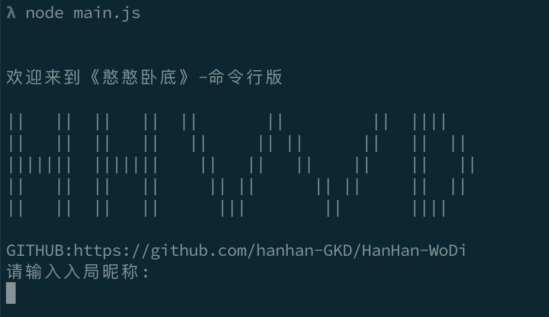
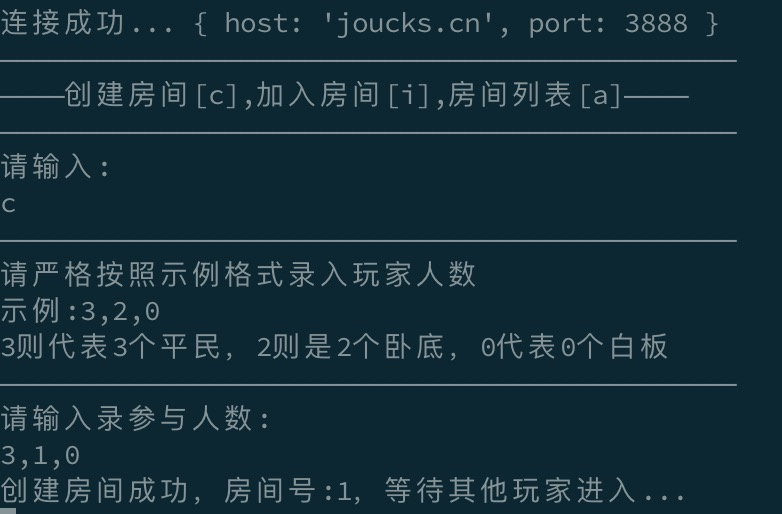

# HanHan-WoDi
### HanHan-WoDi是一款nodejs编写的命令行版《谁是卧底》

### 客户端
**1.需要准备好node环境  官网:http://nodejs.cn/**

**2.使用git将代码clone到本地**

` git clone git@github.com:hanhan-GKD/HanHan-WoDi.git `

**没有git 可在此网站下载zip包，地址:**

`https://github.com/hanhan-GKD/HanHan-WoDi/archive/master.zip

**3.需要已有服务器部署server服务，默认config中配置为作者公共服`joucks.cn`**

**4.进入client目录用执行:`node main.js`**

### 服务端部署

**1.config目录下index.json为服务器相关配置，words.json则为词汇**

**2.配置好config/index.json后根目录执行:**
`node server/server.js`

**3.让客户端配置config/index.json中client为启动的node服务ip与端口即可**

### 游戏截图

